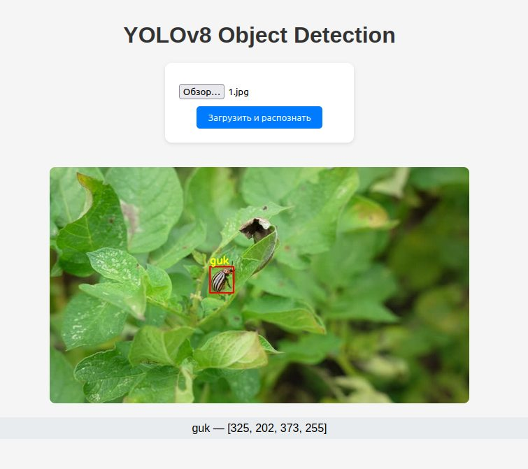

# YOLOv8 FastAPI Demo

Простейшее приложение на **FastAPI** для детекции объектов с помощью **YOLOv8**.  
Можно загрузить изображение и получить размеченную картинку + список найденных объектов.

## Скриншот



## Запуск

1. Установите зависимости:

```bash
pip install -r requirements.txt
```

2. Запустите сервер:

```bash
uvicorn app.main:app --reload
```

3. Откройте в браузере: `http://127.0.0.1:8000`

## Возможности

- Загрузка изображения через веб-страницу
- Инференс YOLOv8
- Отмеченные bounding-box на картинке
- Список найденных объектов

## Документация API

FastAPI автоматически генерирует Swagger-документацию:

- Swagger UI: [http://127.0.0.1:8000/docs](http://127.0.0.1:8000/docs)
- ReDoc: [http://127.0.0.1:8000/redoc](http://127.0.0.1:8000/redoc)
