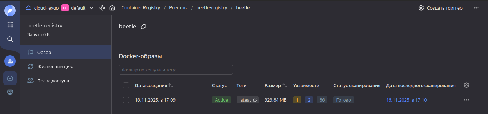
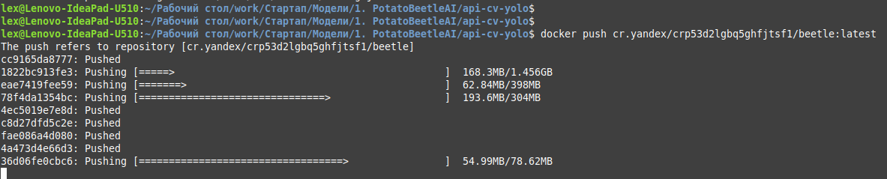
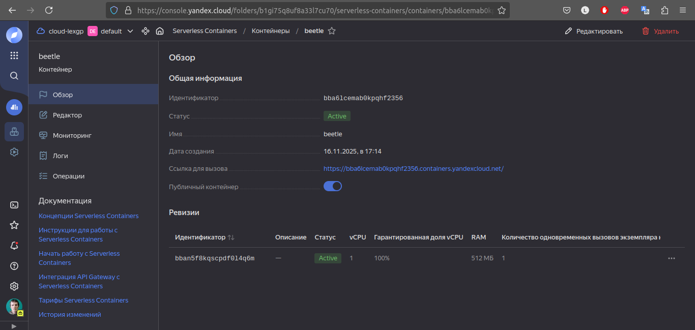
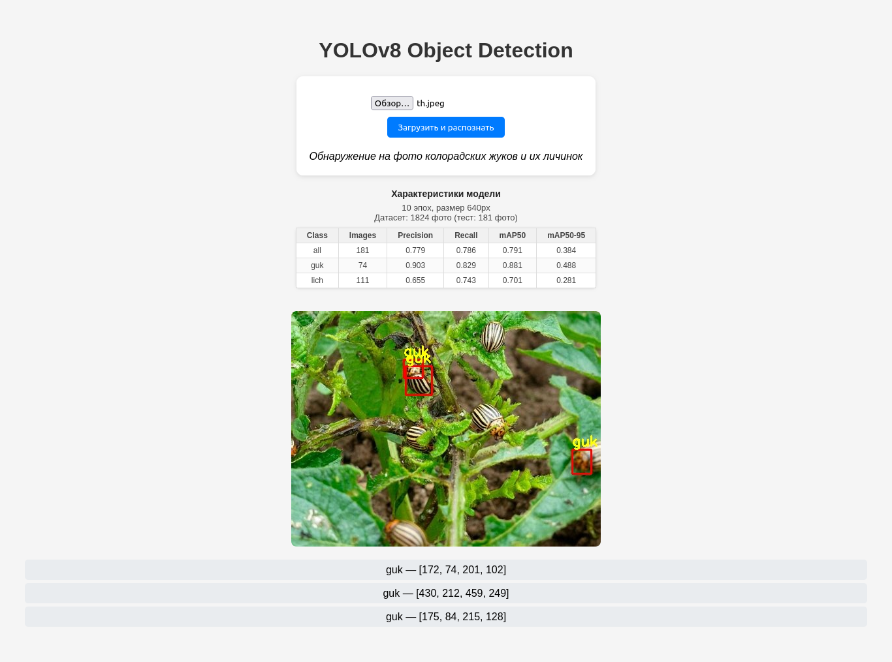

# Домашнее задание 4. Контейнеризация и docker.

Автор: *Зырянов Алексей Николаевич*, М08-401НД, 16.11.2025

~~У автора работы совершенно не возникало желания идти сжигать офис компании Яндекс, громить кувалдой её сервера и вообще не было никаких позывов к массовому геноциду её сотрудников.~~

На личном ноутбуке у меня стоит:
- Linux mint
- Docker version 28.1.1
- Docker Compose version v2.35.1

Делать буду в терминале.

Вот https://github.com/lexgp/api-cv-yolo у меня был учебный проект, распознование колорадских жуков, YOLO моделька и FastAPI интерфейс/api для взаимодействия с ней.
По времени коммитов можете убедиться, что ранее сервис докеризирован не был.

## 1. Докеризируем приложение.

Dockerfile

```bash
# syntax=docker/dockerfile:1.4

### STAGE 1 — builder #######################################
FROM python:3.10-slim AS builder
WORKDIR /app

COPY requirements.txt .

RUN pip config set global.timeout 120
RUN pip config set global.retries 20

# кэширование pip + сборка wheel
RUN --mount=type=cache,target=/root/.cache/pip \
    pip wheel --no-cache-dir --wheel-dir=/wheels -r requirements.txt

COPY . .

##############################################################

### STAGE 2 — runtime ########################################
FROM python:3.10-slim AS runtime
WORKDIR /app

# OpenCV deps
RUN apt-get update && apt-get install -y \
    libgl1 \
    libglib2.0-0 \
    libsm6 \
    libxext6 \
    libxrender1 \
 && rm -rf /var/lib/apt/lists/*

# установка зависимостей из wheels
COPY --from=builder /wheels /wheels
RUN pip install --no-cache-dir /wheels/*

COPY . .

CMD ["uvicorn", "app.main:app", "--host", "0.0.0.0", "--port", "8080"]
##############################################################
```

То есть сбока идёт в 2 этапа: сначала ставим базовые зависимости, а потом уже оставшиеся, копируем код в контейнер, запускаем вебсервер.

docker-compose.yml

```yaml
services:
  app:
    build:
      context: .
    image: beetle:latest
    ports:
      - "8080:8080"
```

Даём имя образу, прокидываем порт. Для дальнейшего деплоя у Яндекса нам нужен будет 8080 порт.

Для разработки добавим ещё один конфиг docker-compose.dev.yml:

```yaml
services:
  app:
    volumes:
      - .:/app
    command: uvicorn app.main:app --host 0.0.0.0 --reload
```

Суть разницы в том, чтобы на горячую реагировал на изменения в коде.

Запускать для деплоя так:
`docker compose -f docker-compose.yml up -d --build`

Для разработки так:
`docker compose -f docker-compose.yml -f docker-compose.dev.yml up --build`

## 2. Serverless деплой в Яндекс Облаке

Выполняемый код буду сопровождать так же результатами вывода, потом всё равно всё поудаляю.


### Создаём новый Container Registry

```bash
yc container registry create --name beetle-registry
> done (1s)
> id: crp53d2lgbq5ghfjtsf1
> folder_id: b1gi75q8uf8a33l7cu70
> name: beetle-registry
> status: ACTIVE
> created_at: "2025-11-16T13:54:26.828Z"
```

```bash
yc container registry list
```

| ID | NAME | FOLDER ID |
|----|------|-----------|
| crp53d2lgbq5ghfjtsf1 | beetle-registry | b1gi75q8uf8a33l7cu70 |
Мой registry ID crp53d2lgbq5ghfjtsf1



### Теперь надо загрузить мой докер образ в Яндекс Облако.

Смотрим мои докер образы:

```bash
docker images
```
| REPOSITORY | TAG    | IMAGE ID    | CREATED    | SIZE  |
|------------|--------|-------------|------------|-------|
| beetle     | latest | 04fd156487d7| 8 hours ago| 2.29GB|

docker tag beetle:latest cr.yandex/crp53d2lgbq5ghfjtsf1/beetle:latest

Закинуть в докер авторизацию для яндекса:
yc container registry configure-docker

Наконец-то пушим образ.
docker push cr.yandex/crp53d2lgbq5ghfjtsf1/beetle:latest



### Теперь это надо запустить.

```bash
yc serverless container create --name beetle
```
```log
done (1s)
id: bba6lcemab0kpqhf2356
folder_id: b1gi75q8uf8a33l7cu70
created_at: "2025-11-16T14:14:50.236Z"
name: beetle
url: https://bba6lcemab0kpqhf2356.containers.yandexcloud.net/
status: ACTIVE
```

Создать сервисный аккаунт:

```bash
yc iam service-account create --name beetle-sa
```
`id: ajeieo8eed1c7dnu8uo2`

Дать ему права:

```bash
yc container registry add-access-binding \
  --id crp53d2lgbq5ghfjtsf1 \
  --role container-registry.images.puller \
  --service-account-id ajeieo8eed1c7dnu8uo2
```

### Запускаем

```bash
yc serverless container revision deploy \
  --container-name beetle \
  --image cr.yandex/crp53d2lgbq5ghfjtsf1/beetle:latest \
  --memory 512M \
  --cores 1 \
  --concurrency 1 \
  --service-account-id ajeieo8eed1c7dnu8uo2 \
```



Посмотреть логи:
`yc logging read --limit 100`

Запустилось. Интерфейс взаимодействия с моделью доступен по адресу:
https://bba6lcemab0kpqhf2356.containers.yandexcloud.net/



Можно загрузить картинку, [эту например](https://github.com/lexgp/api-cv-yolo/blob/main/repo/test.jpeg), и узнать есть ли на ней колорадские жуки.

## Выводы.
Почему-то именно от взаимодействия с Яндекс.Облаком всегда остаётся такое впечатление: вроде бы постфактум всё логично, последовательно, но кажется будто можно было сделать гораздо проще.

Долго. Сложно.

На VPS я тоже самое за 5-10 минут делаю.

Но опять же, я привык работать с монолитами запущенными в одном экземпляре, для моих масштабов этого раньше хватало.
Перспектива зачем всё это нужно понятна.

В следующей домашке постараюсь разобраться как деплоить ML модель правильно, а не пихать её в git.